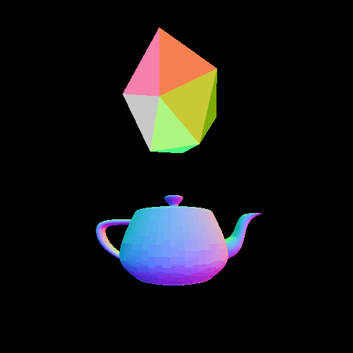

# Low-Level Game-Making Library (LLGML)

## Description
This project was made as an effort to simplify the complexity of OpenGL's various features and act as a sort of wrapper for them. Many repetitive tasks are wrapped, such as window creation, rendering, etc.

## Features
Expect this "documentation" to eventually find a new home

### Window Creation / Manipulation
* `gm_initWindow()` - Wrapper for SDL2's window initializer, also does much behind-the-scenes setup
* `gm_handleEvents()` - Currently overly simple, but will be expanded
* `gm_msDelay()` - Simple wrapper for `SDL_Delay`
* `gm_setFrameRate()`, `gm_getFrameRate()` - FPS setter/getter (see next function pair)
* `gm_endFrame()` - Delays execution to align with the set FPS; gets time information from `gm_beginFrame()`
* `gm_renderClear()` - Clears the screen with the specified `gm_Color`
* `gm_renderDisplay()` - Swaps the buffers to present the next frame
* `gm_exit()` - Quits the application
* `GM_ASPECTRATIO` - Quick and dirty Aspect Ratio

### Colors!
* `gm_Color_t` - Basically SDL_Color. Normalized (0.0-1.0)
* `gm_ColorEquals` - Compares two `gm_Color_t`s

### Shaders
* `gm_createShader()` - Reads a shader (GLSL) file, provides its compiled ID
* `gm_createShaderProgram()` - Links multiple shaders together into a program, provides its ID
* `gm_setActiveShaderProgram()` - Self-documenting function

### Player Camera
* `gm_cameraInit()` - Required before using the camera
* `gm_setCameraPos()`, `gm_cameraLookat()`, `gm_rotateCamera()` - Classic matrix transformations
* `gm_updateMatrices()` - Call this every frame; provides "proj" and "view" uniform matrices
* `gm_printCameraMatrices()` - Pretty much just for debug

### 3D Objects
* `Object_t` - A (hidden) struct type for a manipulatable and renderable 3D object
* `Triangle_t` - Another hidden struct; just a wrapper for 3 vertices
* `Vertex_t` - Also hidden; not really intended for outside use. I should move this.
* `gm_create3dObjectFromTriangles()` - Not really useful outside of the library, due to hidden nature of Triangle_t
* `gm_create3dObjectFromVerticesAndIndices()` - A slightly convoluted way of creating an `Object_t` with the provided vertices. Much simpler than using each of the OpenGL functions, I believe.
* `gm_create3dObjectFromSTL()` - Provide the file's path, get an object back! Currently works only for binary STL files
* `gm_getObjectSize()` - I realized as I was typing this that this function name is unclear. It actually gets the size in bytes of the vertices it holds
* `gm_getObjectData()` - Returns its internal array of vertex data
* `gm_getObjectTriangleCount()` - Self-documenting function
* `gm_moveObject()`, `gm_setObjectPosition()`, `gm_rotateObject()` - Classic transformations of the object's model matrix
* `gm_renderObject()` - What's the point of all this object creation if we can't even see what we're making! Provides "model" uniform matrix

### Some 3D Primitaves (more to come)
These are mostly made for testing purposes and might be heavily revised
* `square_vertices[]` - A 1.5-unit square, centered on the xy-plane
* `cube_vertices[]` - ~~Stolen~~ *Borrowed* from [LearnOpenGL.com](https://learnopengl.com/code_viewer.php?code=getting-started/cube_vertices)
* `icosahedron_vertices[]` - Lifted from [Mathematics Stack Exchange](https://math.stackexchange.com/questions/2174594/co-ordinates-of-the-vertices-an-icosahedron-relative-to-its-centroid)
* `icosahedron_indices[]` - Proper vertex ordering for `icosahedron_vertices`

### Debugging
In C, error checking and debugging takes up a lot of lines. Here, I have attempted to simplify the process.
* `errType` - Can be either `ERR_CODE` or `ERR_MESG`; tells the following function how to behave
* `gm_setError()`/`gm_getError()` - set and get the latest error message. Use in case something goes wrong - it should have useful information
* `print1dFloatArrayAsTable()` - Useful for debugging matrices and vertices
* `gm_checkAndPrintError()` - Checks if there is a current GL Error (glGetError). Prints the error if so. Should be made obsolete by:
* `MessageCallback()` - Synchronous error printer used by OpenGL

### TODO:
* Rename `gm_getObjectSize()`
* Rename `print1dFloatArrayAsTable()`
* Hide `Triangle_t`, `Vertex_t` if not used outside
* Better input reading
* Move camera around with input
* Ensure projection matrix works
* Clean up (make consistent) `shapes.h`, add more shapes
* Plaintext STL files (and other 3D files)
* 2D/3D switching option?

### Notes:
* For simplicity and convenience when working in OpenGL, all coordinates are right-handed, with +Y up and +Z toward the observer.